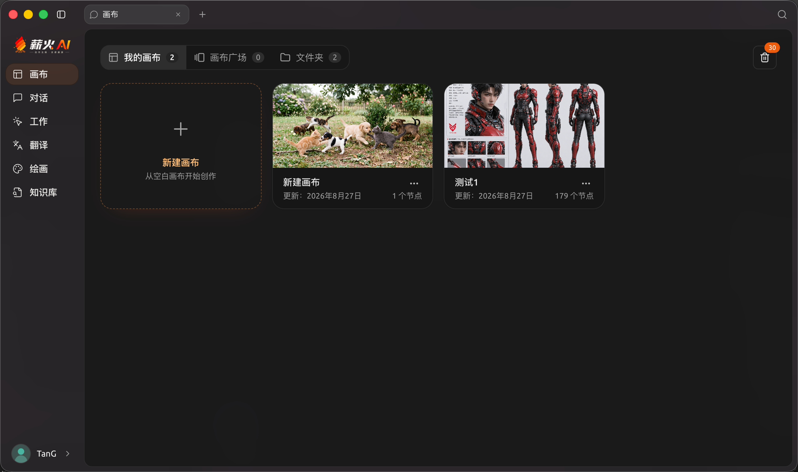
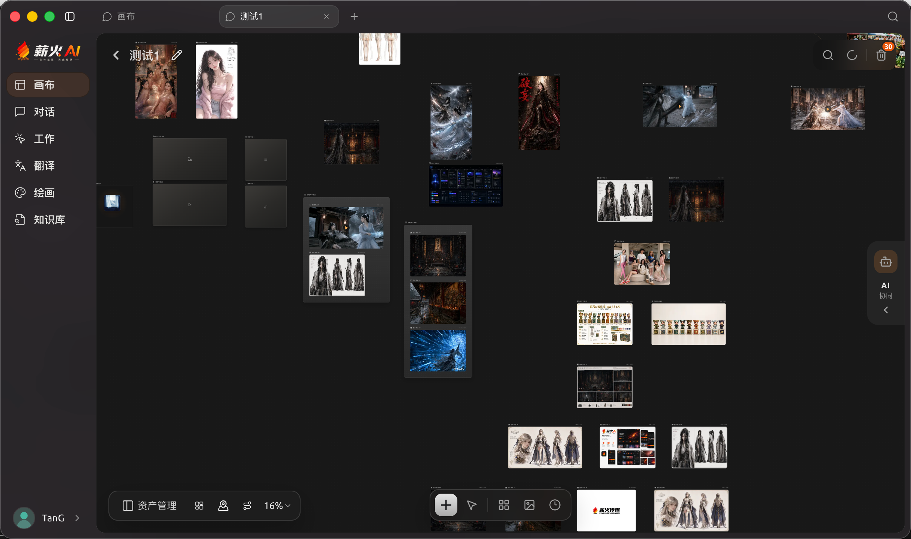
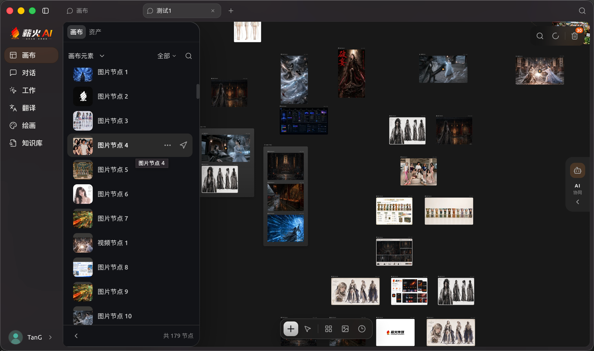
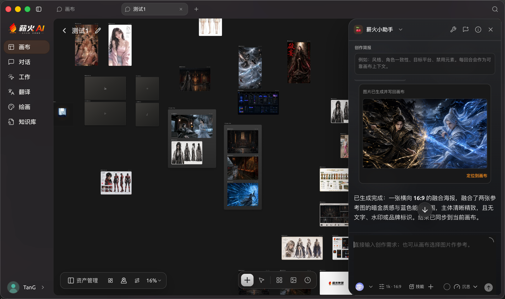
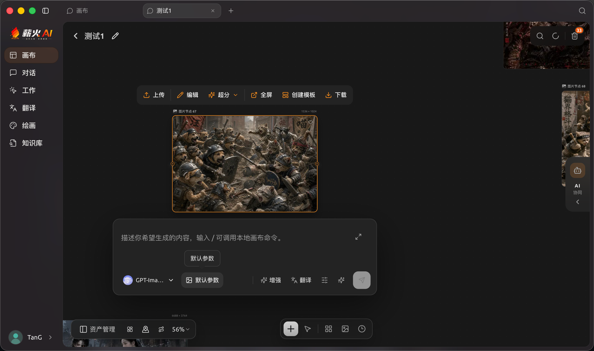
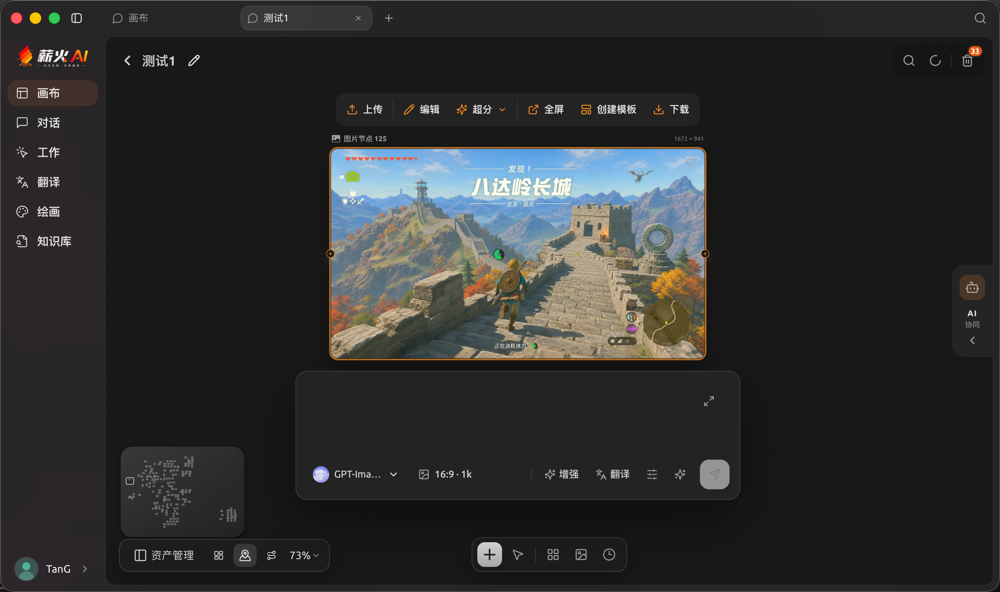
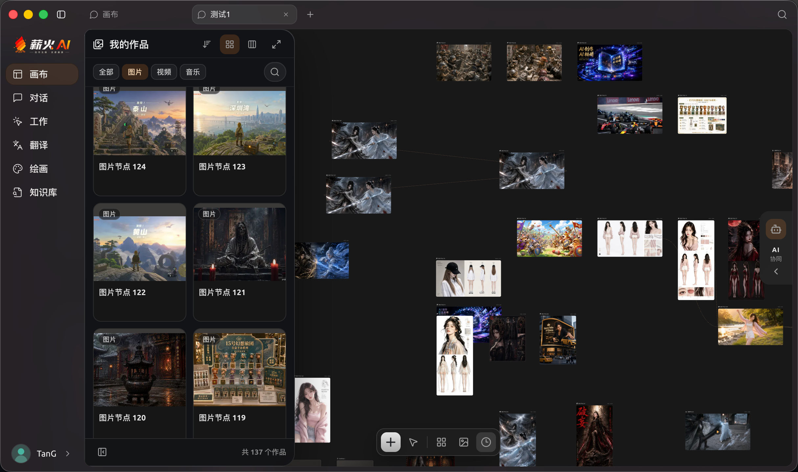
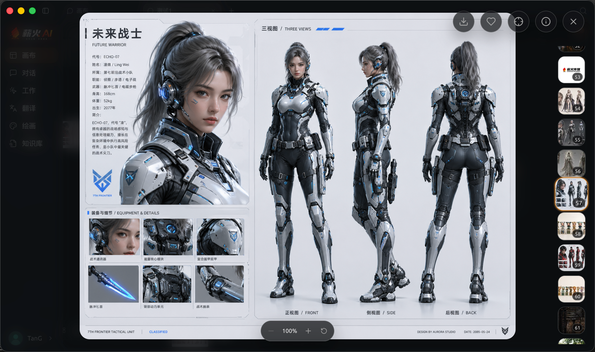

  

<h1 align="center">薪火 AI Desktop Agent Canvas</h1>

面向 macOS 的本地创作画布与媒体资产工作台。

  
  

## 下载与安装

请前往 [Releases 下载最新版 DMG](https://github.com/240344520/xinghuoai-desktop-agent-canvas/releases/latest)：

- `arm64`：适用于 Apple Silicon（M 系列芯片）。
- `x64`：适用于 Intel Mac。

下载后打开 DMG，将“薪火 AI”拖入“应用程序”即可。若 macOS 在首次打开时显示安全提示，请按系统指引确认来源后再继续。

## 功能概览

- **画布管理**：新建、查看和进入本地画布项目，并以节点组织创作素材与结果。
- **多媒体节点**：在画布中承载图片、文本、视频、音频等不同类型的内容。
- **节点操作**：提供上传、编辑、增强、全屏查看、创建模板和下载等常用入口。
- **创作参数面板**：在画布内选择模型、比例、尺寸等参数并提交创作需求。
- **资产管理**：按图片、视频、音频浏览本地作品，并将资产用于画布创作。
- **媒体预览**：放大查看素材、切换相邻内容，并可定位回对应画布。
- **创作协作面板**：在画布上下文中输入创作需求、查看结果并继续操作。

## 界面预览

| 画布列表 | 画布详情 |
| --- | --- |
|  |  |

| 画布资产面板 | 创作协作面板 |
| --- | --- |
|  |  |

| 节点工具栏 | 画布内创作参数面板 |
| --- | --- |
|  |  |

| 媒体资产库 | 媒体预览 |
| --- | --- |
|  |  |

## 使用说明

普通用户只需下载并安装 DMG。画布浏览、资产管理和本地编辑不要求安装开发环境；云端生成及部分外部能力取决于你在应用中接入的服务、账户、额度和个人访问凭据。

本仓库仅提供正式发布的应用安装包、产品介绍和界面预览，不包含产品源码、开发分支、构建脚本或内部文档。

如需反馈问题，请在 [Issues](https://github.com/240344520/xinghuoai-desktop-agent-canvas/issues) 中附上复现步骤、应用版本、macOS 版本、芯片架构和必要的脱敏日志；不要提交个人资料或访问凭据。
